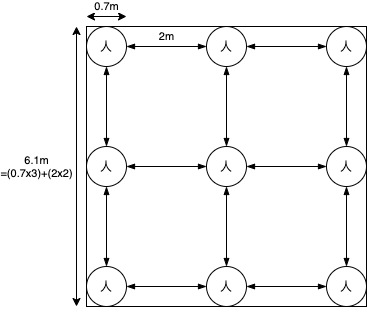
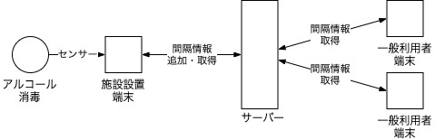
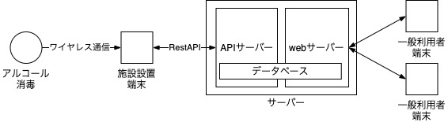

# 室内ソーシャルディスタンス計測システム

## はじめに

このREADMEでは、「室内ソーシャルディスタンス計測システム」の概要を説明させていただきます。 各機能のコード説明等は下記リンクをご覧いただけると幸いです。現在開発済みの範囲はセンサーとRestAPIとなっております。Webアプリケーションに関しても随時更新していく予定です。

- [センサー](./doc/Sensor.md)
- [APIサーバー](./doc/APIServer.md)

## 概要

### 背景

2021年現在でもコロナウイルスの影響は弱まることはなく、私達は自粛生活を余儀なくされている。そのような環境から外出時の目的施設の混雑状況や人との距離といった目的施設の環境に対して敏感にならざるをえなくなっている。現在、Googleが提供するローカル リスティング情報などから施設の混雑状況を把握することができる。しかし、このサービスだけでは実際の訪問者数や室内での人と人との距離がソーシャルディスタンスとして適正かを判断することができない。本システムは、そんな実際の訪問者数や室内でのソーシャルディスタンスに着目したシステムとなっている。

### 課題と目的

上記の背景から以下の二点が課題であると考える。そして、この二点を解決することが本システムの目的である。

- **目的施設でのリアルタイムな訪問者数がわからない**
- **室内での人と人との距離がソーシャルディスタンスとして適切か判断することができない**

### 解決案

本システムでは、上記の課題を以下の方法で解決する。

- 目的施設でのリアルタイムな訪問者数がわからない
  - **アルコール消毒スプレーにセンサーを設置することでリアルタイムの訪問者数を計測する**
- 室内での人と人との距離がソーシャルディスタンスとして適切か判断することができない
  - **事前に施設内の利用区域を面積として入力し、その情報とリアルタイムの訪問者数から人口密度を計測する。その値を人との間隔へ変換することでソーシャルディスタンスが守られているかを判断する**。

はじめに「アルコール消毒スプレーにセンサーを設置することでリアルタイムの訪問者数を計測する」について説明する。 現在、コロナウイルスの影響から飲食店や商業施設、公共施設など、どの施設でも出入りの際にアルコール消毒の利用を徹底している。これを利用し、アルコール消毒が利用された回数をリアルタイムで計測する。そこから訪問者数を計測することで、施設のリアルタイムでの訪問者数をデータ化させる。

次に「事前に施設内の利用区域を面積として入力し、その情報とリアルタイムの訪問者数から人口密度を計測する。その値を人との間隔へ変換することでソーシャルディスタンスが守られているかを判断する。」について説明する。 まず、上記の方法で訪問者数の計測を行う。それに加え事前に施設内の利用区域を面積として入力しておくことで、実際の施設内の人口密度を計測する。計算方法を下記で説明するが、人口密度を間隔へ変換することで、利用者がソーシャルディスタンスが守られているのかを認識しやすくする。

### 計算方法（人口密度→間隔）

上記の図のように、人（横幅を0.7mとして）がソーシャルディスタンスのとして広まっている2m間隔で並んだ場合は、縦横6.1mの正方形の中に並んでいることになる。この場合の人口密度は、9人 / (6.1mx6.1m)  = 0.2418....となる。よって**人口密度が0.242以下**の場合にソーシャルディスタンスが守られているということになる。 そして、上記の計算式から、間隔をy,人口密度をxとして、**y=2x/0.242**で人口密度から間隔を計算することができる。

#### 計算方法の場合分け

上記の方法では、何もない空間の場合のみ適応され、飲食店といった客席と待合室が別れている施設では正しい間隔を計算することができない。そこで、下記のようなに施設に応じて適した計算方法をとることで、施設内での空間に役割が分かれている場合でも正しい間隔を計算を行うことができる。

##### 飲食店（客席と待合室が別れている場合）

このような飲食店の場合は客席と待合室に計測対象を分割して計算する。 客席は、席数と席同士の間隔を事前に計測する。事前に設定された席数を訪問者数が超えた場合に待合室に計測対象を移行する。待合室は事前に面積を入力しておき、その情報と訪問者数から人口密度を計測する。

##### 飲食店（客席と待合室が同じ場合）

このような飲食店の場合は、上記（客席と待合室が別れている場合）と同様に席数とその間隔を事前に計測する。それに加えて待合エリアとして利用される区域を事前に計測する。これらを利用し、訪問者数に応じて対象範囲を拡大する。 訪問者数が席数を超えていない場合は（客席と待合室が別れている場合）の客席と同様に事前に入力された席同士の間隔を利用する。訪問者数が席数を超えた場合は、客席の計測方法を人口密度へ変更し、その対象面積に待合人数x一人分の面積を加えた面積から人口密度を計算する。対象面積に加える待合人数x一人分の面積は、事前に計測された待合エリアとして利用される区域の面積を上限として、それを超えた場合は面積を固定する。そうすることで、正しい間隔を計算する。

## システム構造図

本システムは上記の形でデータのやり取りを行う。

本システムは上記の設計で構築する。

## 機能

- アルコール消毒
  - アルコール消毒の利用者数を検知する、センサー機能
- 施設端末
  - センサーで収集したデータから人口密度と間隔を求める、データ処理機能
  - RESTAPIを利用した、データをサーバー上のデータベースへ追加する機能
- サーバー
  - 施設端末とデータのやり取りをする、APIサーバー
  - データベース上のデータを利用して、一般利用者が利用するwebアプリケーションを生成するwebサーバー

## 注力した機能・工夫した点

- RESTを利用した認証機能付きのAPI
  - 利用者登録機能とトークン認証機能をつけることで、施設管理者のみデータの追加を可能にした。
  - 利用者は認証なしでデータへのアクセスが可能である。
  - 施設管理者の利用者登録情報を呼び出す際に、他者の登録情報を呼び出せないよう実装した。
  - RESTで情報を呼び出すときに情報を絞り込めるように、フィルター機能を実装した。
- アルコール消毒のセンサー
  - 通行人などには反応しないよう改良した。
  - 連続使用での誤作動が怒らないように改良した。

## 今後の課題

今後の課題として以下の三つが挙げられる。これらを解決することが今後の課題となる。

- 客席の数や間隔を事前に入力する手間がある。
- 飲食店やスーパーマーケットなど、場合に応じた計算方法が必要であり、汎用可能な計算方法の考案には至っていない。
- 人口密度を利用した間隔の計算では、施設内で人が偏った配置担った場合の間隔が計測できない。

